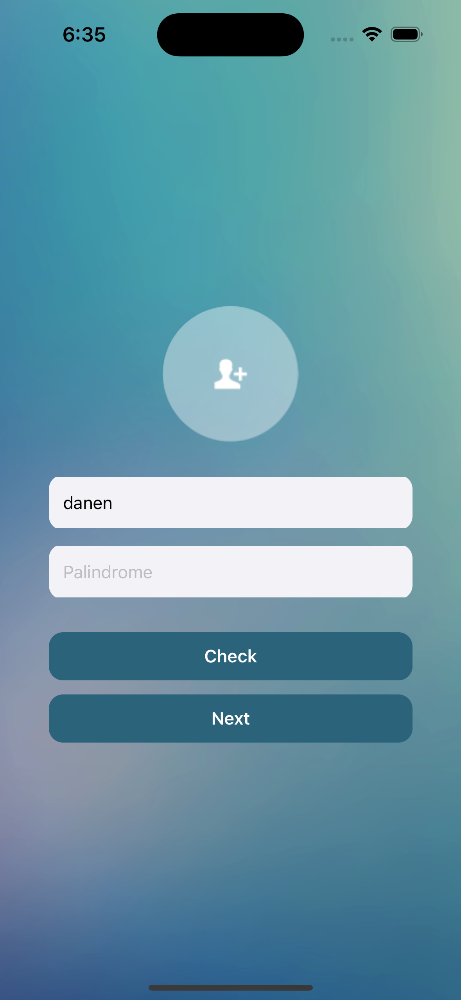
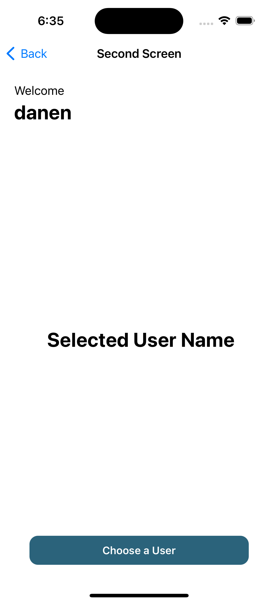
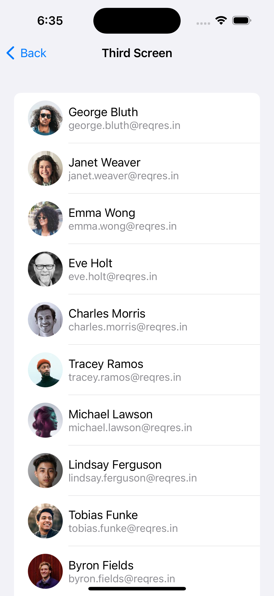

# SuitMedia Test

## Deskripsi

Proyek ini adalah aplikasi mobile yang dikembangkan menggunakan Swift dalam waktu 24 jam sebagai bagian dari tes magang di SuitMedia. Saya menggunakan Swift untuk menyelesaikan tugas ini.

## Fitur Utama

<div>1. Menambahkan foto diri dengan klik button photo</div>
<div>2. Menambahkan nama user</div>
<div>3. Check Palindrome Teks</div>

<div>1. Nama user ditampilkan sesuai yang diinput sebelumnya</div>
<div>2. Nama user yang dipilih dipage selanjutnya akan tampil dicenter page</div>
<div>3. Terdapat button choose user yang akan membawa ke page 3</div>

<div>1. Memilih user untuk ditampilkan dipage 2</div>
<div>2. Data dicollect melalui api <a href="https://reqres.in/api/users?page=\(currentPage)&per_page=\(perPage)">Reqres.in</a></div>


## Instalasi

Untuk menjalankan proyek ini, ikuti langkah-langkah berikut:

1. Clone repository ini:
    ```bash
    git clone https://github.com/nenz24/SuitMedia-test.git.git
    ```
2. Buka proyek di Xcode.
3. Jalankan aplikasi menggunakan Xcode dengan memilih target perangkat atau simulator.

## Kontribusi

Jika Anda ingin berkontribusi pada proyek ini, silakan ikuti langkah-langkah berikut:

1. Fork repository ini.
2. Buat cabang (`branch`) baru untuk perubahan Anda.
3. Lakukan perubahan dan komit.
4. Kirim pull request dengan deskripsi singkat tentang perubahan yang Anda buat.

## Kontak

Jika Anda memiliki pertanyaan, silakan hubungi saya melalui <a href="mailto:danendracool08@gmail.com">**Email!** </a>.
